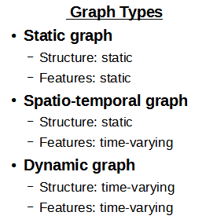
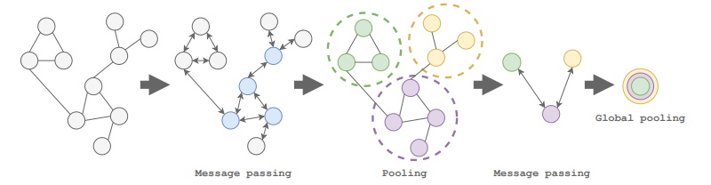

# Spatio-Temporal-Graph-Convolutional-Networks-for-Time-Series
Spatio-temporal graph convolutional neural network for time series forecasting

## Introduction

We focus on spatio-temporal graphs, characterized by static structures or topologies, and dynamic feature values.

The process of training a message-passing graph neural network is depicted in the figure below, extracted from [1]. 
THe message-passing step utilizes local information from neighbors to construct representations of the nodes in the graph. 
The message-passing operation has analogies with convolutional layers in computer vision models. Pooling operations simplify 
the topology and facilitate the learning hierarchical representations of the graph data.
Learning is understood as model optimization via stochastic optimizaton tools with a defined loss function [2,3]

## References

[1] Grattarola, Daniele, and Cesare Alippi. "Graph neural networks in TensorFlow and keras with spektral [application notes]." IEEE Computational Intelligence Magazine 16.1 (2021): 99-106.

[2] "The basics of spatio-temporal graph neural networks", Jacob Heglund, https://www.youtube.com/watch?v=RRMU8kJH60Q

[3] "Deep learning with dynamic graph neural networks", Jacob Heglund, https://www.youtube.com/watch?v=01EP23yHSwU